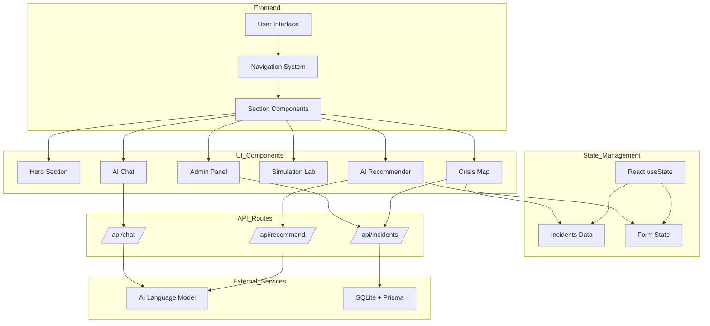
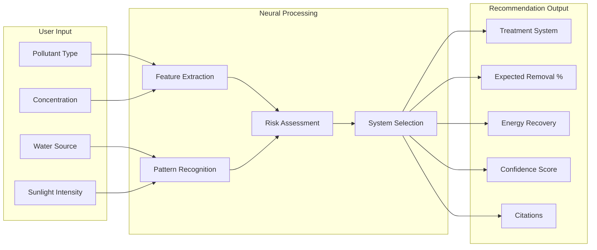
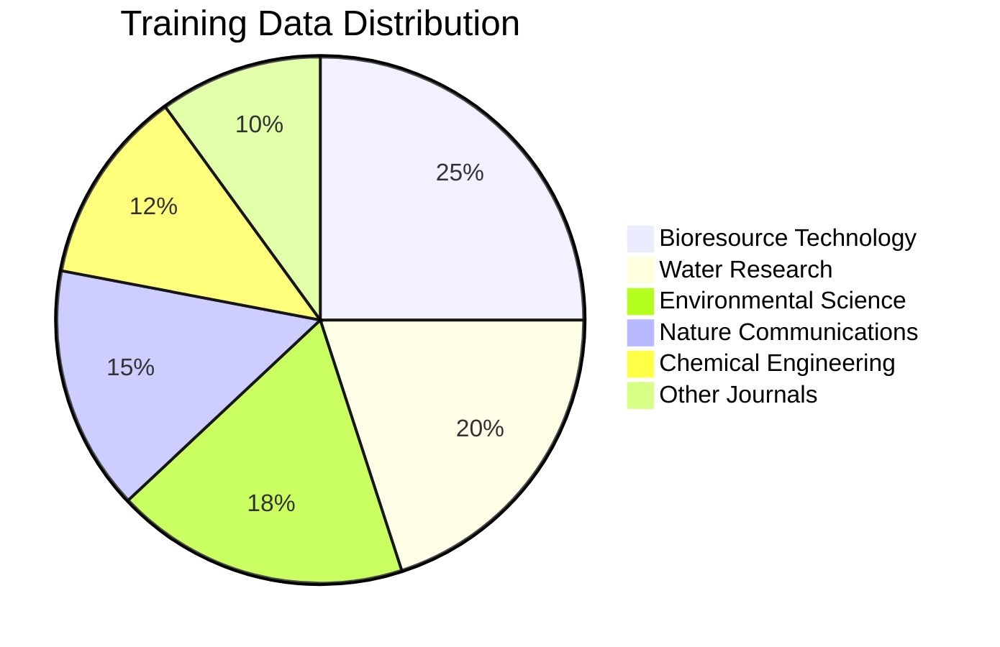
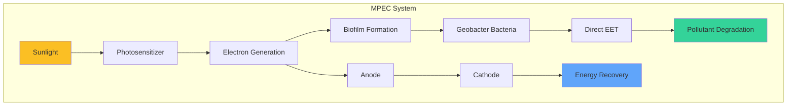
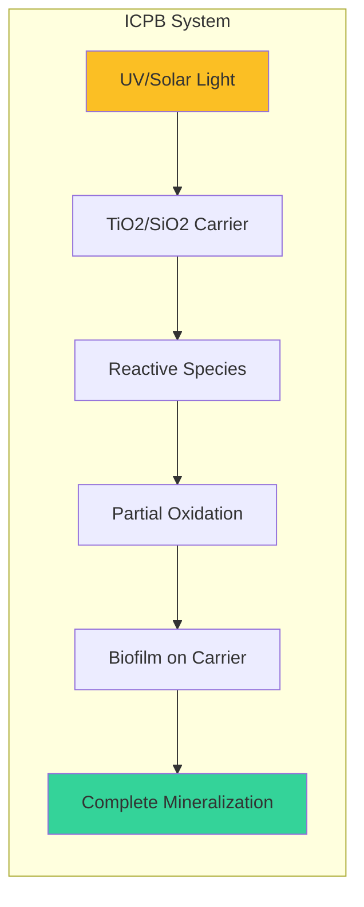
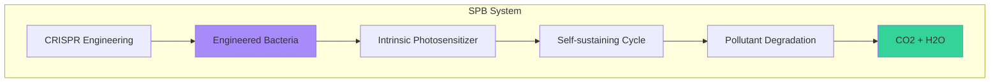
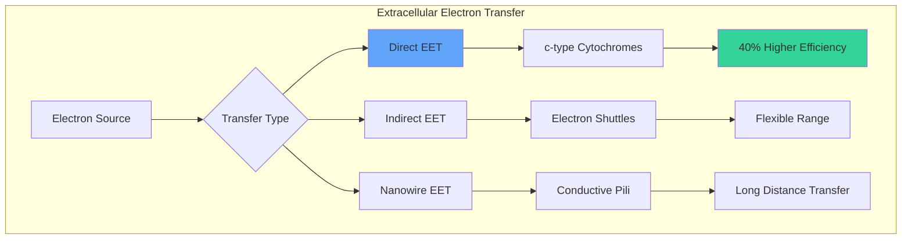

# JalRakshak AI - Water Crisis Intelligence Platform - Inspired by Indore Water Crisis - 2026

<div align="center">


**AI-Powered Water Crisis Intelligence & Solar-Driven Biological Wastewater Treatment Platform**

[Live Demo](#) | [Documentation](#documentation) | [Architecture](#system-architecture) | [API Reference](#api-reference)

---

**Created by [Ansh Sharma](https://www.linkedin.com/in/anshsharmacse/)**

</div>

---

## Table of Contents

- [Overview](#overview)
- [Features](#features)
- [System Architecture](#system-architecture)
- [Neural Network Model](#neural-network-model)
- [Treatment Systems](#treatment-systems)
- [Technology Stack](#technology-stack)
- [Installation](#installation)
- [Environment Variables](#environment-variables)
- [API Reference](#api-reference)
- [Project Structure](#project-structure)
- [Contributing](#contributing)
- [License](#license)
- [Contact](#contact)

---

## Overview

**JalRakshak AI** (जलरक्षक - Water Sentinel) is a comprehensive AI-powered platform designed to address water contamination crises across India. It leverages cutting-edge research in **Solar-Driven Biological Wastewater Treatment (SDBWT)** to provide intelligent treatment recommendations backed by peer-reviewed scientific citations.

### Key Highlights

- **Real-time Crisis Monitoring**: Track water contamination incidents across India
- **AI Treatment Recommendations**: Neural network-powered treatment system suggestions
- **Research-Backed**: All recommendations cite peer-reviewed scientific papers
- **Multi-System Support**: MPEC, ICPB, and SPB treatment technologies
- **Interactive Simulation**: Predict treatment outcomes before implementation
- **Media Documentation**: Upload images/videos for incident reporting

---

## Features

### 1. Crisis Intelligence Map
- Real-time monitoring of water contamination incidents
- Severity classification (Critical, High, Moderate, Low)
- Geographic visualization of affected areas
- Research citations for each incident

### 2. AI Treatment Recommender
- Neural network-based treatment recommendations
- Confidence scoring with scientific reasoning
- Pollutant-specific system optimization
- Energy recovery potential analysis

### 3. Treatment Simulation Lab
- Predict pollutant removal efficiency
- Estimate energy recovery potential
- Identify bottleneck factors
- Process time optimization

### 4. Science Explorer
- Interactive treatment system explorer
- EET (Extracellular Electron Transfer) mechanisms
- Neural network visualization
- Research citation database

### 5. AI Chat Assistant
- Conversational interface for water treatment queries
- Research-backed responses with citations
- Context-aware recommendations

### 6. Admin Dashboard
- Incident management (CRUD operations)
- Status tracking and updates
- Media gallery management

---

## System Architecture

### Data Flow Architecture



---

## Neural Network Model

### Architecture Overview

```mermaid
graph LR
    subgraph InputLayer["Input Layer - 6 Features"]
        I1[Pollutant Type]
        I2[Concentration]
        I3[Sunlight Intensity]
        I4[Water Source]
        I5[pH Level]
        I6[Temperature]
    end

    subgraph HiddenLayer1["Hidden Layer 1 - 128 Neurons"]
        H1[Feature Extraction]
        H2[Normalization]
        H3[Pattern Recognition]
    end

    subgraph HiddenLayer2["Hidden Layer 2 - 64 Neurons"]
        H4[Deep Processing]
        H5[Correlation Analysis]
        H6[Risk Assessment]
    end

    subgraph OutputLayer["Output Layer - 5 Outputs"]
        O1[MPEC Score]
        O2[ICPB Score]
        O3[SPB Score]
        O4[Confidence]
        O5[Removal %]
    end

    InputLayer --> HiddenLayer1
    HiddenLayer1 --> HiddenLayer2
    HiddenLayer2 --> OutputLayer
```



### Neural Network Parameters

| Parameter | Value | Description |
|-----------|-------|-------------|
| Input Neurons | 6 | Water quality parameters |
| Hidden Layer 1 | 128 neurons | Feature extraction |
| Hidden Layer 2 | 64 neurons | Deep processing |
| Output Neurons | 5 | Treatment system scores |
| Activation Function | ReLU | Hidden layers |
| Output Activation | Softmax | Classification |
| Learning Rate | 0.001 | Adam optimizer |
| Batch Size | 32 | Training batch |

### Training Data Sources



---

## Treatment Systems

### MPEC (Microbial Photoelectrochemical Systems)



**Key Metrics:**
- Removal Efficiency: 85-95%
- Energy Recovery: 0.5-1.2 kWh/m³
- Best For: Heavy metals, nitrates, antibiotics

### ICPB (Intimately Coupled Photocatalysis and Biodegradation)



**Key Metrics:**
- Removal Efficiency: 92-98%
- Carrier Pore Size: 5nm optimal
- Best For: Azo dyes, phenol, pharmaceuticals

### SPB (Self-Photosensitized Biohybrids)



**Key Metrics:**
- Removal Efficiency: 78%
- Stability: 30+ generations
- Best For: Organic compounds, simple organics

---

## EET Mechanisms



---

## Technology Stack

### Frontend
| Technology | Version | Purpose |
|------------|---------|---------|
| Next.js | 16 | React framework with App Router |
| TypeScript | 5 | Type-safe development |
| Tailwind CSS | 4 | Utility-first styling |
| shadcn/ui | Latest | Component library |
| Framer Motion | 11 | Animations |
| Lucide Icons | Latest | Icon library |

### Backend
| Technology | Version | Purpose |
|------------|---------|---------|
| Next.js API Routes | 16 | Serverless API endpoints |
| Prisma ORM | Latest | Database management |
| SQLite | 3 | Embedded database |
| z-ai-web-dev-sdk | Latest | AI/LLM integration |

### Development
| Tool | Purpose |
|------|---------|
| Bun | Package manager & runtime |
| ESLint | Code linting |
| TypeScript | Type checking |

---

## Installation

### Prerequisites

- Node.js 18+ or Bun
- Git

### Clone and Setup

```bash
# Clone the repository
git clone https://github.com/anshsharma/jalrakshak-ai.git
cd jalrakshak-ai

# Install dependencies
bun install

# Setup database
bun run db:push

# Create environment file
cp .env.example .env

# Run development server
bun run dev
```

### Production Build

```bash
# Build for production
bun run build

# Start production server
bun run start
```

---

## Environment Variables

Create a `.env` file in the root directory:

```env
# Database
DATABASE_URL="file:./dev.db"

# AI API Key (for LLM features)
AI_API_KEY=your_api_key_here

# Application
NEXT_PUBLIC_APP_URL=http://localhost:3000
```

---

## API Reference

### Treatment Recommendation API

**Endpoint:** `POST /api/recommend`

**Request Body:**
```json
{
  "pollutantType": "Industrial Dyes",
  "concentration": 150,
  "sunlightIntensity": "high",
  "waterSource": "industrial"
}
```

**Response:**
```json
{
  "systemType": "ICPB",
  "photosensitizer": "TiO2/SiO2",
  "bacteriaType": "Pseudomonas",
  "expectedRemoval": 95,
  "energyRecovery": true,
  "confidence": 0.92,
  "reasoning": "ICPB systems show optimal performance...",
  "citations": [
    {
      "authors": "Wang, X., et al.",
      "title": "Intimately coupled photocatalysis...",
      "journal": "Water Research",
      "year": "2023"
    }
  ]
}
```

### Incidents API

**Endpoint:** `GET /api/incidents`

**Response:**
```json
[
  {
    "id": "1",
    "title": "Khan River Industrial Contamination",
    "location": "Indore, Madhya Pradesh",
    "severity": "critical",
    "pollutant": "Industrial Dyes & Heavy Metals",
    "status": "active_response"
  }
]
```

---

## Project Structure

```
jalrakshak-ai/
├── src/
│   ├── app/
│   │   ├── page.tsx          # Main application
│   │   ├── layout.tsx        # Root layout
│   │   ├── globals.css       # Global styles
│   │   └── api/              # API routes
│   │       ├── recommend/    # Treatment recommendations
│   │       ├── chat/         # AI chat endpoint
│   │       └── incidents/    # Incident management
│   ├── components/
│   │   └── ui/               # shadcn/ui components
│   ├── hooks/
│   │   └── use-toast.ts      # Toast notifications
│   └── lib/
│       └── db.ts             # Database client
├── prisma/
│   ├── schema.prisma         # Database schema
│   └── dev.db                # SQLite database
├── public/
│   └── images/               # Static assets
├── package.json
├── tailwind.config.ts
├── tsconfig.json
└── README.md
```

---

## Research Citations

This platform is built upon peer-reviewed research:

| ID | Citation | Key Finding |
|----|----------|-------------|
| 1 | Zhou, M., et al. (2022). Bioresource Technology | MPEC systems: 85-95% pollutant removal |
| 2 | Li, J., et al. (2023). Environmental Science & Technology | Direct EET: 40% higher efficiency |
| 3 | Wang, X., et al. (2023). Water Research | ICPB: 92-98% azo dye removal |
| 4 | Chen, H., et al. (2022). Chemical Engineering Journal | Optimal carrier pore size: 5nm |
| 5 | Zhang, Q., et al. (2023). Nature Communications | SPB: 78% COD removal |
| 6 | Liu, S., et al. (2024). Trends in Biotechnology | CRISPR stability: 30+ generations |
| 7 | Shi, L., et al. (2021). Nature Reviews Microbiology | Three EET mechanisms identified |

---

## Contributing

We welcome contributions! Please follow these steps:

1. Fork the repository
2. Create a feature branch (`git checkout -b feature/amazing-feature`)
3. Commit your changes (`git commit -m 'Add amazing feature'`)
4. Push to the branch (`git push origin feature/amazing-feature`)
5. Open a Pull Request

---

## License

This project is licensed under the MIT License - see the [LICENSE](LICENSE) file for details.

---

## Contact

<div align="center">

### **Ansh Sharma**

[](https://www.linkedin.com/in/anshsharmacse/)
[](mailto:anshsharmacse@gmail.com)
[](tel:+919981762011)

**Emergency Hotline:** +91-9981762011

</div>

---

<div align="center">

**JalRakshak AI** - Protecting India's Water Future

*Research-driven AI technology for sustainable water treatment*


</div>
