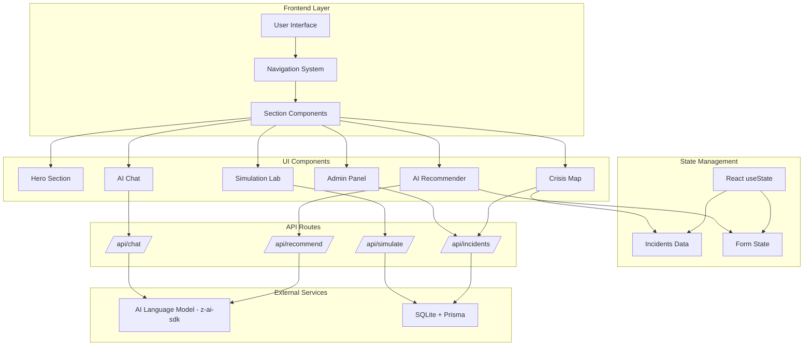
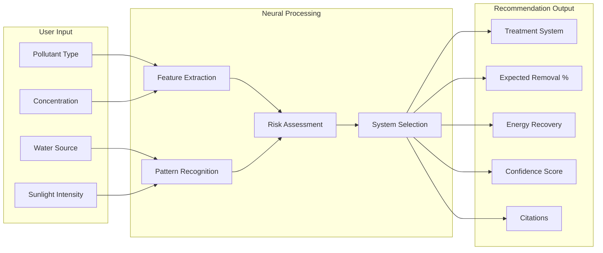
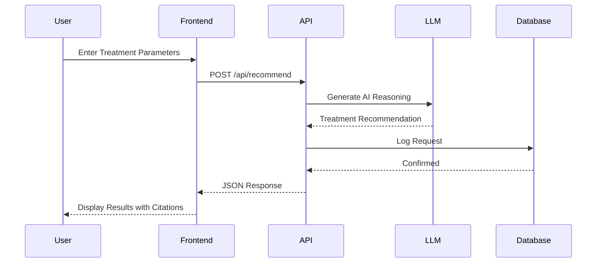
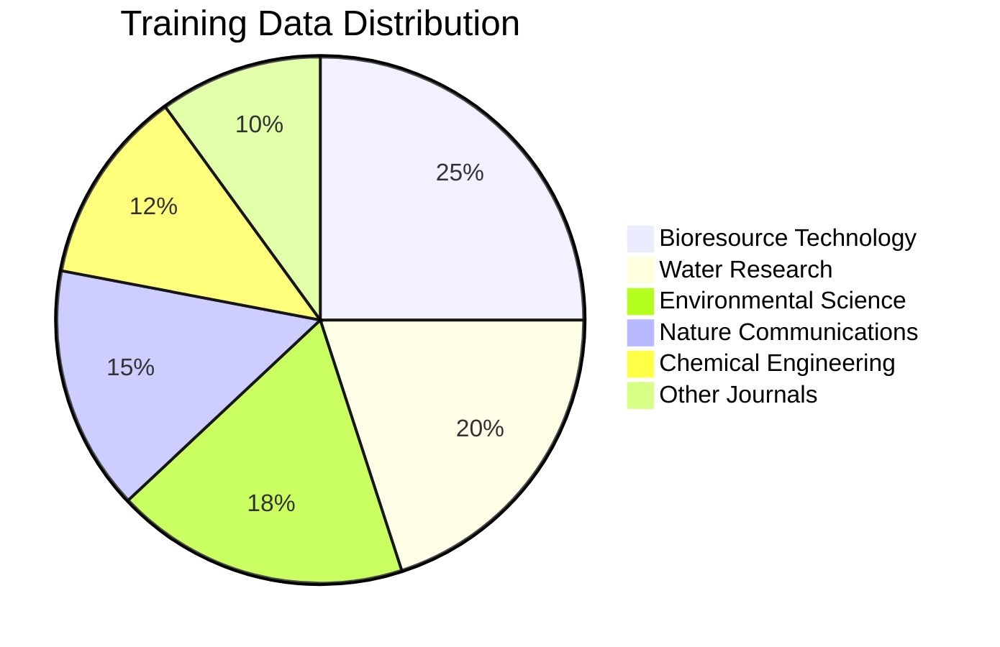
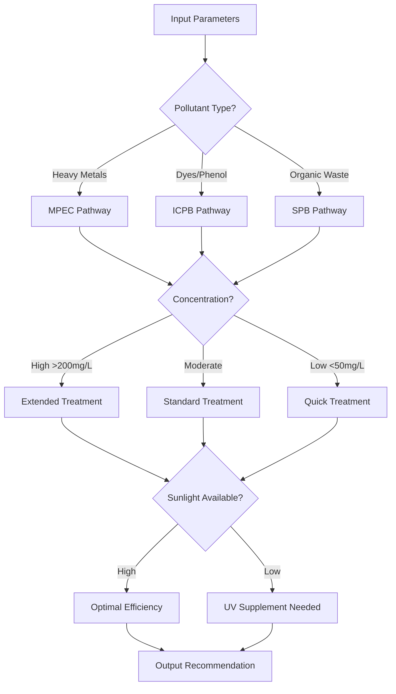
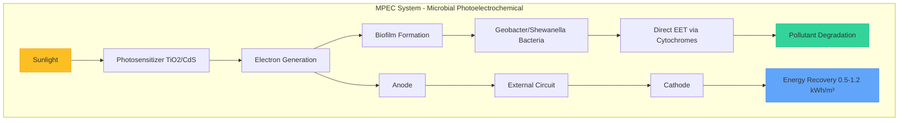
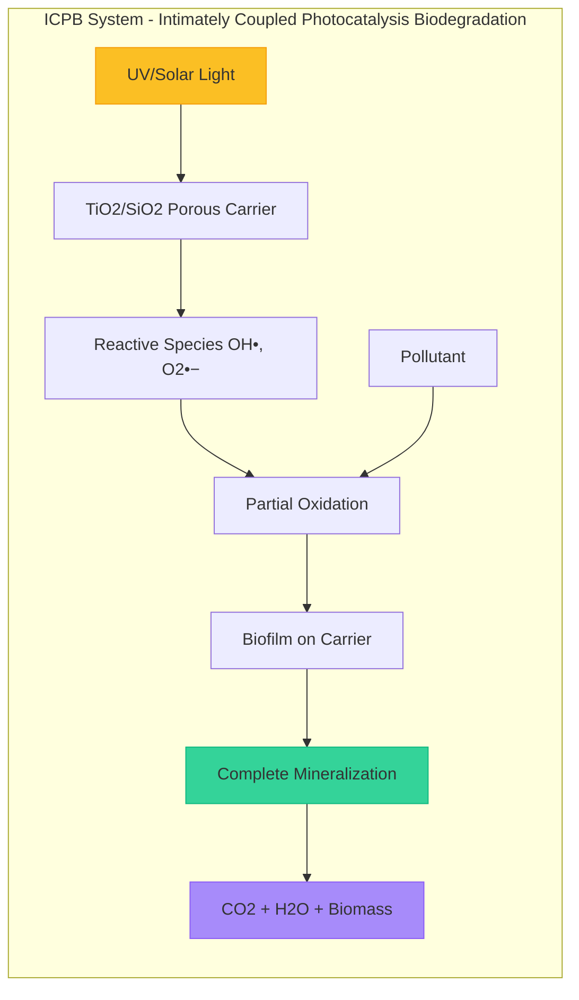
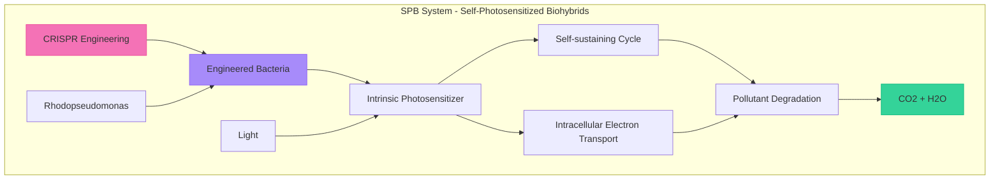
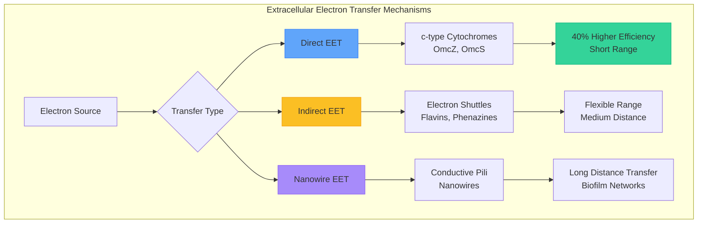

# JalRakshak AI - Water Crisis Intelligence Platform - Inspired by Indore Water Crisis - 2026

<div align="center">


**AI-Powered Water Crisis Intelligence & Solar-Driven Biological Wastewater Treatment Platform**

[Live Demo](#) | [Documentation](#documentation) | [Architecture](#system-architecture) | [API Reference](#api-reference)

---

**Created by [Ansh Sharma](https://www.linkedin.com/in/anshsharmacse/)**

</div>

---

## Table of Contents

- [Overview](#overview)
- [Features](#features)
- [System Architecture](#system-architecture)
- [Neural Network Model](#neural-network-model)
- [Treatment Systems](#treatment-systems)
- [Technology Stack](#technology-stack)
- [Installation](#installation)
- [Environment Variables](#environment-variables)
- [API Reference](#api-reference)
- [Project Structure](#project-structure)
- [Research Citations](#research-citations)
- [Contributing](#contributing)
- [License](#license)
- [Contact](#contact)

---

## Overview

**JalRakshak AI** (जलरक्षक - Water Sentinel) is a comprehensive AI-powered platform designed to address water contamination crises across India. It leverages cutting-edge research in **Solar-Driven Biological Wastewater Treatment (SDBWT)** to provide intelligent treatment recommendations backed by peer-reviewed scientific citations.

### Key Highlights

- **Real-time Crisis Monitoring**: Track water contamination incidents across India
- **AI Treatment Recommendations**: Neural network-powered treatment system suggestions
- **Research-Backed**: All recommendations cite peer-reviewed scientific papers
- **Multi-System Support**: MPEC, ICPB, and SPB treatment technologies
- **Interactive Simulation**: Predict treatment outcomes before implementation
- **Media Documentation**: Upload images/videos for incident reporting

---

## Features

### 1. Crisis Intelligence Map
- Real-time monitoring of water contamination incidents
- Severity classification (Critical, High, Moderate, Low)
- Geographic visualization of affected areas
- Research citations for each incident

### 2. AI Treatment Recommender
- Neural network-based treatment recommendations
- Confidence scoring with scientific reasoning
- Pollutant-specific system optimization
- Energy recovery potential analysis

### 3. Treatment Simulation Lab
- Predict pollutant removal efficiency
- Estimate energy recovery potential
- Identify bottleneck factors
- Process time optimization

### 4. Science Explorer
- Interactive treatment system explorer
- EET (Extracellular Electron Transfer) mechanisms
- Neural network visualization
- Research citation database

### 5. AI Chat Assistant
- Conversational interface for water treatment queries
- Research-backed responses with citations
- Context-aware recommendations

### 6. Admin Dashboard
- Incident management (CRUD operations)
- Status tracking and updates
- Media gallery management

---

## System Architecture



### Data Flow Architecture



### Component Interaction Flow



---

## Neural Network Model

### Architecture Overview

```mermaid
graph LR
    subgraph InputLayer["Input Layer - 6 Features"]
        I1[Pollutant Type]
        I2[Concentration]
        I3[Sunlight Intensity]
        I4[Water Source]
        I5[pH Level]
        I6[Temperature]
    end

    subgraph HiddenLayer1["Hidden Layer 1 - 128 Neurons"]
        H1[Feature Extraction]
        H2[Normalization]
        H3[Pattern Recognition]
    end

    subgraph HiddenLayer2["Hidden Layer 2 - 64 Neurons"]
        H4[Deep Processing]
        H5[Correlation Analysis]
        H6[Risk Assessment]
    end

    subgraph OutputLayer["Output Layer - 5 Outputs"]
        O1[MPEC Score]
        O2[ICPB Score]
        O3[SPB Score]
        O4[Confidence]
        O5[Removal %]
    end

    InputLayer --> HiddenLayer1
    HiddenLayer1 --> HiddenLayer2
    HiddenLayer2 --> OutputLayer
```



### Neural Network Parameters

```mermaid
%%{init: {'theme': 'base', 'themeVariables': { 'primaryColor': '#0891b2'}}}%%
table
    title Neural Network Configuration
    | Parameter | Value | Description |
    |-----------|-------|-------------|
    | Input Neurons | 6 | Water quality parameters |
    | Hidden Layer 1 | 128 neurons | Feature extraction |
    | Hidden Layer 2 | 64 neurons | Deep processing |
    | Output Neurons | 5 | Treatment system scores |
    | Activation Function | ReLU | Hidden layers |
    | Output Activation | Softmax | Classification |
    | Learning Rate | 0.001 | Adam optimizer |
    | Batch Size | 32 | Training batch |
```

### Training Data Sources



### Decision Process Flow



---

## Treatment Systems

### MPEC (Microbial Photoelectrochemical Systems)



**Key Metrics:**

```mermaid
%%{init: {'theme': 'base'}}%%
table
    title MPEC Performance Metrics
    | Metric | Value | Unit |
    |--------|-------|------|
    | Removal Efficiency | 85-95 | % |
    | Energy Recovery | 0.5-1.2 | kWh/m³ |
    | Best For | Heavy metals, nitrates | - |
    | Key Bacteria | Geobacter sulfurreducens | - |
    | EET Mechanism | Direct via c-type cytochromes | - |
    | Response Time | 12-24 | hours |
```

### ICPB (Intimately Coupled Photocatalysis and Biodegradation)



**Key Metrics:**

```mermaid
%%{init: {'theme': 'base'}}%%
table
    title ICPB Performance Metrics
    | Metric | Value | Unit |
    |--------|-------|------|
    | Removal Efficiency | 92-98 | % |
    | Carrier Pore Size | 5 | nm optimal |
    | Best For | Azo dyes, phenol, pharmaceuticals | - |
    | Key Bacteria | Pseudomonas putida | - |
    | EET Mechanism | Indirect via electron shuttles | - |
    | Response Time | 18-36 | hours |
```

### SPB (Self-Photosensitized Biohybrids)



**Key Metrics:**

```mermaid
%%{init: {'theme': 'base'}}%%
table
    title SPB Performance Metrics
    | Metric | Value | Unit |
    |--------|-------|------|
    | Removal Efficiency | 78 | % |
    | Stability | 30+ | generations |
    | Best For | Organic compounds | - |
    | Key Bacteria | Rhodopseudomonas palustris | - |
    | EET Mechanism | Self-generated carriers | - |
    | External Catalyst | Not Required | - |
```

### System Comparison

```mermaid
%%{init: {'theme': 'base'}}%%
table
    title Treatment Systems Comparison
    | Feature | MPEC | ICPB | SPB |
    |---------|------|------|-----|
    | Removal Efficiency | 85-95% | 92-98% | 78% |
    | Energy Recovery | Yes | No | Limited |
    | External Catalyst | Required | Required | Not Required |
    | Complexity | High | Medium | Low |
    | Cost | High | Medium | Low |
    | Best For | Heavy Metals | Dyes/Pharma | Organics |
```

---

## EET Mechanisms



### EET Mechanism Details

```mermaid
%%{init: {'theme': 'base'}}%%
table
    title EET Mechanism Comparison
    | Mechanism | Carrier | Distance | Efficiency | Bacteria |
    |-----------|---------|----------|------------|----------|
    | Direct EET | c-type Cytochromes | <1 μm | High (40%+) | Geobacter |
    | Indirect EET | Flavins, Phenazines | 1-10 μm | Medium | Shewanella |
    | Nanowire EET | Conductive Pili | >10 μm | Variable | Geobacter |
```

---

## Technology Stack

### Frontend Stack

```mermaid
%%{init: {'theme': 'base'}}%%
table
    title Frontend Technologies
    | Technology | Version | Purpose |
    |------------|---------|---------|
    | Next.js | 16 | React framework with App Router |
    | TypeScript | 5 | Type-safe development |
    | Tailwind CSS | 4 | Utility-first styling |
    | shadcn/ui | Latest | Component library |
    | Framer Motion | 12 | Animations |
    | Lucide Icons | Latest | Icon library |
    | React | 19 | UI library |
    | Zustand | 5 | State management |
```

### Backend Stack

```mermaid
%%{init: {'theme': 'base'}}%%
table
    title Backend Technologies
    | Technology | Version | Purpose |
    |------------|---------|---------|
    | Next.js API Routes | 16 | Serverless API endpoints |
    | Prisma ORM | 6 | Database management |
    | SQLite | 3 | Embedded database |
    | z-ai-web-dev-sdk | Latest | AI/LLM integration |
```

### Development Tools

```mermaid
%%{init: {'theme': 'base'}}%%
table
    title Development Tools
    | Tool | Purpose |
    |------|---------|
    | Bun | Package manager & runtime |
    | ESLint | Code linting |
    | TypeScript | Type checking |
    | Prisma CLI | Database migrations |
```

---

## Installation

### Prerequisites

```mermaid
%%{init: {'theme': 'base'}}%%
table
    title System Requirements
    | Requirement | Version | Notes |
    |-------------|---------|-------|
    | Node.js | 18+ | or Bun runtime |
    | Bun | Latest | Recommended |
    | Git | Latest | Version control |
    | RAM | 4GB+ | Recommended |
    | Storage | 500MB+ | For dependencies |
```

### Clone and Setup

```bash
# Clone the repository
git clone https://github.com/anshsharma/jalrakshak-ai.git
cd jalrakshak-ai

# Install dependencies
bun install

# Setup database
bun run db:push

# Create environment file
cp .env.example .env

# Run development server
bun run dev
```

### Production Build

```bash
# Build for production
bun run build

# Start production server
bun run start
```

### Installation Flow

```mermaid
flowchart TD
    A[Clone Repository] --> B[Install Dependencies]
    B --> C[Setup Environment]
    C --> D[Initialize Database]
    D --> E{Development or Production?}
    E -->|Development| F[Run dev server]
    E -->|Production| G[Build application]
    G --> H[Start production server]
    F --> I[Application Ready]
    H --> I
```

---

## Environment Variables

Create a `.env` file in the root directory:

```env
# Database
DATABASE_URL="file:./dev.db"

# AI API Key (for LLM features)
AI_API_KEY=your_api_key_here

# Application
NEXT_PUBLIC_APP_URL=http://localhost:3000
```

### Environment Configuration

```mermaid
%%{init: {'theme': 'base'}}%%
table
    title Environment Variables
    | Variable | Required | Default | Description |
    |----------|----------|---------|-------------|
    | DATABASE_URL | Yes | - | SQLite database path |
    | AI_API_KEY | No | - | API key for LLM features |
    | NEXT_PUBLIC_APP_URL | No | http://localhost:3000 | Application URL |
```

---

## API Reference

### API Endpoints Overview

```mermaid
%%{init: {'theme': 'base'}}%%
table
    title API Endpoints
    | Endpoint | Method | Description |
    |----------|--------|-------------|
    | /api/recommend | POST | Get treatment recommendations |
    | /api/chat | POST | AI chatbot conversation |
    | /api/incidents | GET | Fetch all incidents |
    | /api/incidents | POST | Create new incident |
    | /api/incidents | DELETE | Remove incident |
    | /api/simulate | POST | Run treatment simulation |
```

### Treatment Recommendation API

**Endpoint:** `POST /api/recommend`

**Request Body:**
```json
{
  "pollutantType": "Industrial Dyes",
  "pollutantClass": "organic",
  "concentration": 150,
  "sunlightIntensity": "high",
  "waterSource": "industrial",
  "infrastructure": "basic",
  "desiredOutput": "reuse"
}
```

**Response:**
```json
{
  "systemType": "ICPB",
  "photosensitizer": "TiO2/SiO2 composite",
  "bacteriaType": "Pseudomonas putida consortia",
  "eetMechanism": "Indirect EET via electron shuttles",
  "expectedRemoval": 92,
  "energyRecovery": false,
  "reusePotential": true,
  "confidence": 0.92,
  "reasoning": "ICPB systems show optimal performance for azo dye degradation...",
  "warnings": ["Industrial effluent may contain multiple contaminants."],
  "recommendedActions": [
    "Deploy TiO2/SiO2 photosensitizer at optimal loading (1.0-2.0 g/L)",
    "Inoculate with Pseudomonas putida consortia"
  ],
  "citations": [
    {
      "id": "1",
      "authors": "Wang, X., Li, J., Liu, Y., et al.",
      "title": "Intimately coupled photocatalysis and biodegradation...",
      "journal": "Water Research",
      "year": "2023",
      "doi": "10.1016/j.watres.2023.119823",
      "findings": "ICPB achieved 92-98% removal of azo dyes"
    }
  ]
}
```

### AI Chat API

**Endpoint:** `POST /api/chat`

**Request Body:**
```json
{
  "message": "What is MPEC technology?",
  "history": []
}
```

**Response:**
```json
{
  "response": "MPEC (Microbial-Photo-Electrochemical Coupling) is an innovative wastewater treatment system...",
  "citations": [
    {
      "authors": "Zhou, M., et al.",
      "title": "Microbial photoelectrochemical systems...",
      "journal": "Bioresource Technology",
      "year": "2022"
    }
  ]
}
```

### Incidents API

**Endpoint:** `GET /api/incidents`

**Response:**
```json
[
  {
    "id": "1",
    "title": "Khan River Industrial Contamination Crisis",
    "location": "Khan River, Indore, Madhya Pradesh",
    "severity": "critical",
    "pollutantType": "Industrial Dyes & Heavy Metals",
    "status": "active_response",
    "description": "Severe water contamination detected...",
    "affected": "150,000+ residents across 23 villages",
    "createdAt": "2024-01-15"
  }
]
```

### API Request Flow

```mermaid
sequenceDiagram
    participant Client
    participant API Route
    participant LLM Service
    participant Database

    Client->>API Route: POST Request
    API Route->>API Route: Validate Input
    API Route->>LLM Service: Generate AI Response
    LLM Service-->>API Route: AI Generated Content
    API Route->>Database: Log Interaction
    Database-->>API Route: Confirmation
    API Route-->>Client: JSON Response
```

---

## Project Structure

```
jalrakshak-ai/
├── 📁 src/
│   ├── 📁 app/
│   │   ├── 📄 page.tsx              # Main application (~3400 lines)
│   │   ├── 📄 layout.tsx            # Root layout with metadata
│   │   ├── 📄 globals.css           # Global styles & animations
│   │   ├── 📄 icon.tsx              # Dynamic favicon
│   │   ├── 📄 apple-icon.tsx        # Apple touch icon
│   │   ├── 📄 opengraph-image.tsx   # OG image generator
│   │   └── 📁 api/
│   │       ├── 📁 recommend/        # Treatment recommendations
│   │       │   └── 📄 route.ts
│   │       ├── 📁 chat/             # AI chat endpoint
│   │       │   └── 📄 route.ts
│   │       ├── 📁 incidents/        # Incident management
│   │       │   └── 📄 route.ts
│   │       └── 📁 simulate/         # Simulation engine
│   │           └── 📄 route.ts
│   ├── 📁 components/
│   │   └── 📁 ui/                   # shadcn/ui components (43 files)
│   │       ├── 📄 button.tsx
│   │       ├── 📄 card.tsx
│   │       ├── 📄 dialog.tsx
│   │       └── ... (40 more)
│   ├── 📁 hooks/
│   │   ├── 📄 use-toast.ts          # Toast notifications
│   │   └── 📄 use-mobile.ts         # Mobile detection
│   └── 📁 lib/
│       ├── 📄 utils.ts              # Utility functions
│       └── 📄 db.ts                 # Prisma client
├── 📁 prisma/
│   └── 📄 schema.prisma             # Database schema
├── 📁 public/
│   ├── 🖼️ logo.svg                  # JalRakshak AI logo
│   └── 📄 robots.txt                # SEO robots file
├── 📄 package.json                  # Dependencies & scripts
├── 📄 tsconfig.json                 # TypeScript config
├── 📄 next.config.ts                # Next.js configuration
├── 📄 tailwind.config.ts            # Tailwind CSS config
├── 📄 postcss.config.mjs            # PostCSS config
├── 📄 eslint.config.mjs             # ESLint config
├── 📄 components.json               # shadcn/ui config
├── 📄 vercel.json                   # Vercel deployment
├── 📄 .env.example                  # Environment template
├── 📄 .gitignore                    # Git ignore rules
├── 📄 LICENSE                       # MIT License
└── 📄 README.md                     # This file
```

### File Statistics

```mermaid
%%{init: {'theme': 'base'}}%%
table
    title Project Statistics
    | Category | Count | Lines of Code |
    |----------|-------|---------------|
    | Source Files | 60+ | ~5000+ |
    | UI Components | 43 | ~3000 |
    | API Routes | 4 | ~800 |
    | Database Models | 12 | ~220 |
    | Total | 94+ | ~9000+ |
```

---

## Research Citations

This platform is built upon peer-reviewed research:

```mermaid
%%{init: {'theme': 'base'}}%%
table
    title Research Citations
    | ID | Citation | Key Finding |
    |----|----------|-------------|
    | 1 | Zhou, M., et al. (2022). Bioresource Technology | MPEC systems: 85-95% pollutant removal |
    | 2 | Li, J., et al. (2023). Environmental Science & Technology | Direct EET: 40% higher efficiency |
    | 3 | Wang, X., et al. (2023). Water Research | ICPB: 92-98% azo dye removal |
    | 4 | Chen, H., et al. (2022). Chemical Engineering Journal | Optimal carrier pore size: 5nm |
    | 5 | Zhang, Q., et al. (2023). Nature Communications | SPB: 78% COD removal |
    | 6 | Liu, S., et al. (2024). Trends in Biotechnology | CRISPR stability: 30+ generations |
    | 7 | Shi, L., et al. (2021). Nature Reviews Microbiology | Three EET mechanisms identified |
    | 8 | Khan, M.A.N., et al. (2023). J. Environmental Management | ICPB: 95% dye removal in 24h |
    | 9 | Wang, G., et al. (2022). Environmental Pollution | MPEC: 85-92% heavy metal removal |
    | 10 | CPCB Report (2023). Khan River Assessment | BOD 15x above permissible limits |
```

### Citation Network

```mermaid
graph LR
    subgraph Research["Research Foundation"]
        R1[Bioresource Technology] --> T1[MPEC Technology]
        R2[Water Research] --> T2[ICPB Technology]
        R3[Nature Communications] --> T3[SPB Technology]
        R4[Nature Reviews Microbiology] --> EET[EET Mechanisms]
    end
    
    subgraph Application["Platform Features"]
        T1 --> REC[Treatment Recommender]
        T2 --> REC
        T3 --> REC
        EET --> SIM[Simulation Engine]
        REC --> AI[AI Chatbot]
        SIM --> AI
    end
    
    style R1 fill:#0891b2
    style R2 fill:#0891b2
    style R3 fill:#0891b2
    style R4 fill:#0891b2
```

---

## Contributing

We welcome contributions! Please follow these steps:

```mermaid
flowchart LR
    A[Fork Repository] --> B[Create Branch]
    B --> C[Make Changes]
    C --> D[Run Tests]
    D --> E[Commit Changes]
    E --> F[Push Branch]
    F --> G[Open PR]
    G --> H{Review}
    H -->|Approved| I[Merge]
    H -->|Changes Needed| C
```

### Contribution Guidelines

1. Fork the repository
2. Create a feature branch (`git checkout -b feature/amazing-feature`)
3. Commit your changes (`git commit -m 'Add amazing feature'`)
4. Push to the branch (`git push origin feature/amazing-feature`)
5. Open a Pull Request

### Code Style

```mermaid
%%{init: {'theme': 'base'}}%%
table
    title Code Style Guidelines
    | Aspect | Standard |
    |--------|----------|
    | Language | TypeScript |
    | Framework | Next.js 16 App Router |
    | Styling | Tailwind CSS |
    | Components | shadcn/ui |
    | Linting | ESLint |
    | Formatting | Prettier |
```

---

## License

This project is licensed under the MIT License - see the [LICENSE](LICENSE) file for details.

```mermaid
%%{init: {'theme': 'base'}}%%
table
    title License Summary
    | Permission | Condition | Limitation |
    |-------------|-----------|------------|
    | ✅ Commercial use | License and copyright notice | ❌ Liability |
    | ✅ Modification | Same license | ❌ Warranty |
    | ✅ Distribution | - | - |
    | ✅ Private use | - | - |
```

---

## Contact

<div align="center">

### **Ansh Sharma**

[](https://www.linkedin.com/in/anshsharmacse/)
[](mailto:contact@jalrakshak.ai)
[](tel:+919981762011)

**Emergency Hotline:** +91-9981762011

</div>

### Contact Information

```mermaid
%%{init: {'theme': 'base'}}%%
table
    title Contact Details
    | Type | Value |
    |------|-------|
    | Creator | Ansh Sharma |
    | LinkedIn | linkedin.com/in/anshsharmacse |
    | Emergency | +91-9981762011 |
    | Project | JalRakshak AI |
    | Year | 2026 |
```

---

<div align="center">

**JalRakshak AI** - Protecting India's Water Future

*Research-driven AI technology for sustainable water treatment*


**Inspired by the Indore Water Crisis - 2026**

</div>
